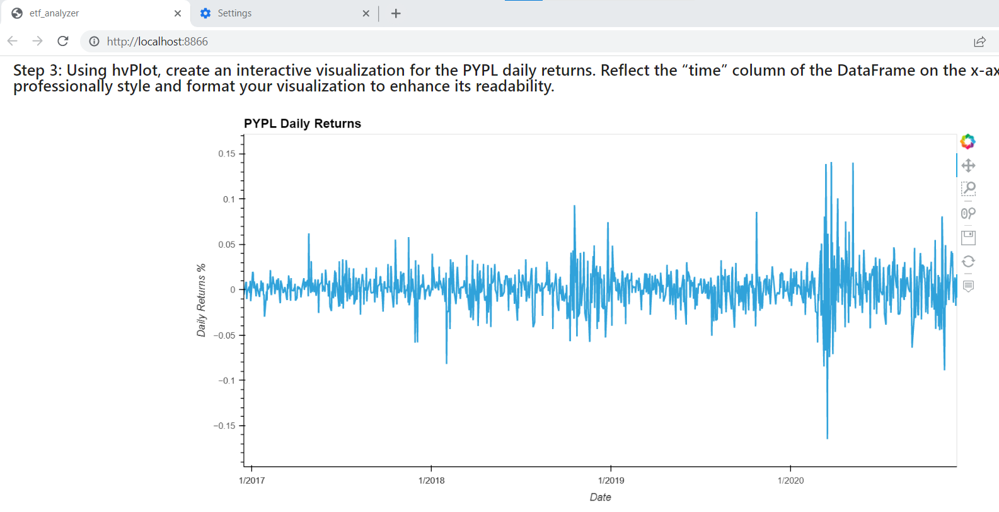

# ETF Analyzer

Analyzing a hypothetical ETF made up of 4 stocks, with data stored in a database.

The analyzer queries the database using SQL and displays content in dataframes and interactive charts.

## Technologies

Built using Python 3.7 with the following libraries:

- [Pandas](https://github.com/pandas-dev/pandas) to make calculating statistics a breeze, and to add charts and tables for visual data.

- [hvplot](https://github.com/holoviz/hvplot) for plotting interactive charts.

- [SQLalchemy](https://www.sqlalchemy.org/) for querying the database.

- [Voila](https://voila.readthedocs.io/en/stable/index.html) to deploy the Jupyter Notebook as a web application.

## Installation Guide

Check Pandas installed by running this command in your terminal:

```pip list```

Pandas is included in the Anaconda package as standard.

Install hvplot using the below command:

```conda install -c pyviz hvplot``` 

Check SQLalchemy and Voila installed with the following commands:

```conda list sqlalchemy```

```conda list voila```

If required, install with:

```pip install SQLAlchemy```

```conda install -c conda-forge voila```


## Usage

To use the analysis, clone the repository and open terminal in the cloned repo location.

Open the notebook using Voila by typing the below command:

```voila etf_analyzer.ipynb```




## Contributors

This application was built by [Toni Mercer](https://www.linkedin.com/in/toni-mercer/) using the Starter Code from the UW FinTech Bootcamp course. 

---

## License

MIT
